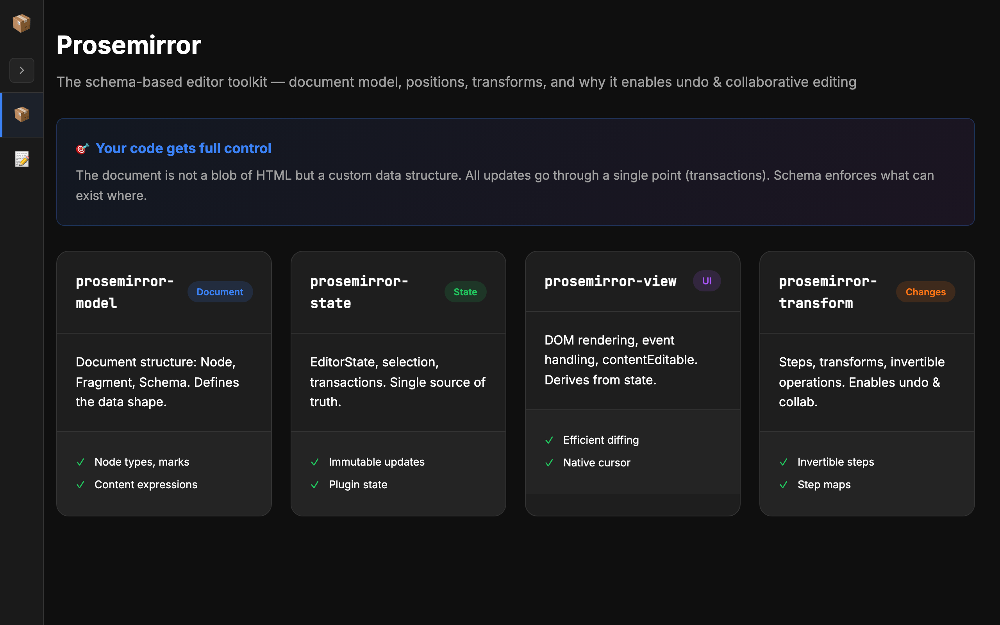
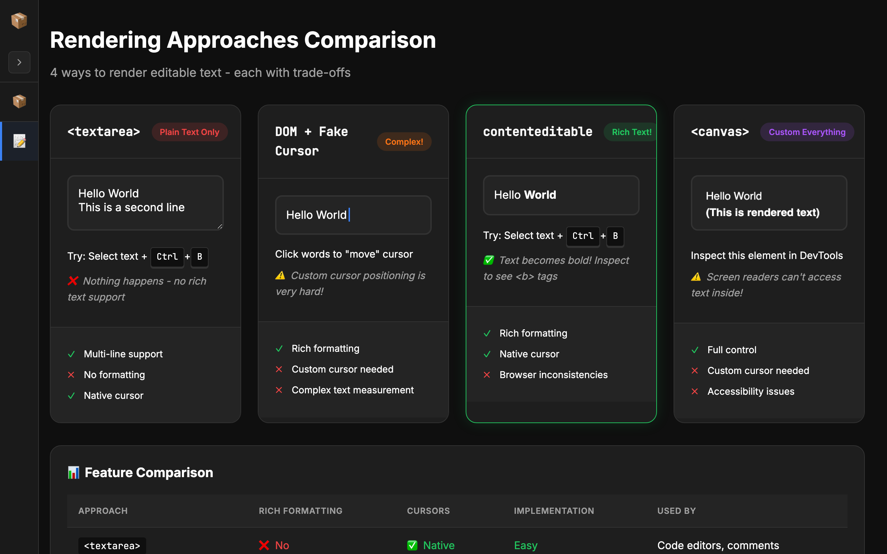
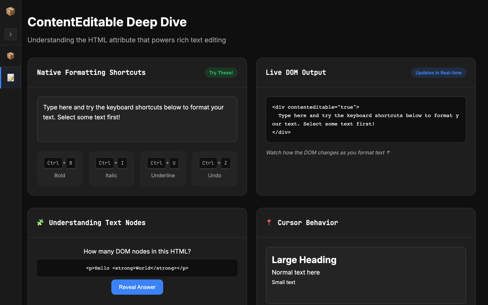
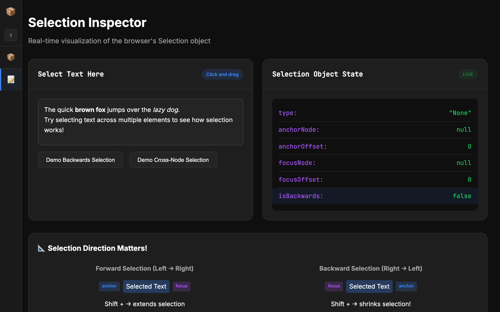
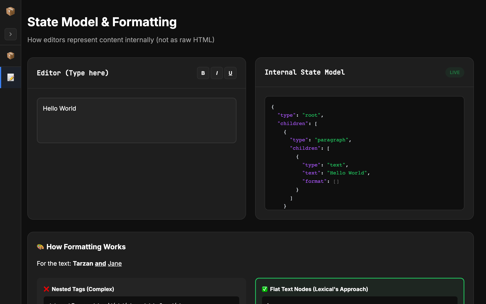
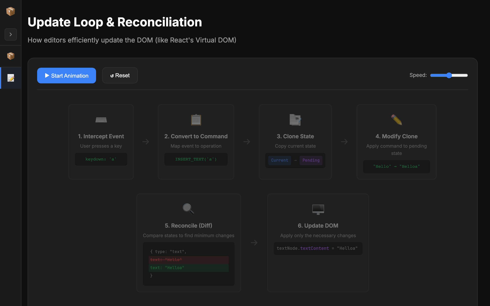
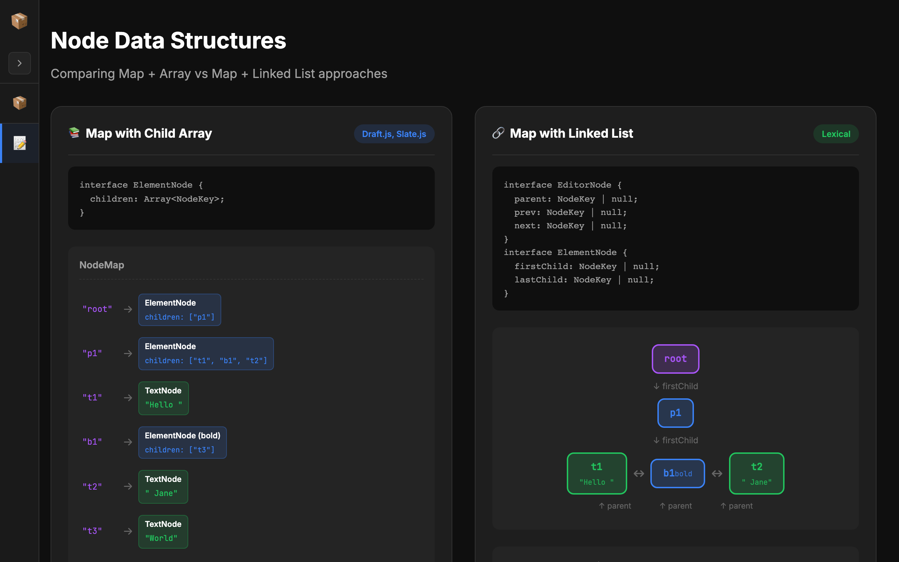

<p align="center">
  
</p>

<h1 align="center">Editor System Design — Prosemirror</h1>

<p align="center">
  <strong>Interactive visual demos that explain how rich text editors work, with Prosemirror at the core</strong>
</p>

<p align="center">
  <a href="#prosemirror">Prosemirror</a> •
  <a href="#rich-text-editor-demos">Rich Text Editor Demos</a> •
  <a href="#why-this-exists">Why This Exists</a> •
  <a href="#tech-stack">Tech Stack</a> •
  <a href="#getting-started">Getting Started</a> •
  <a href="#project-structure">Project Structure</a>
</p>

<p align="center">
  
  
  
  
</p>

---

## Prosemirror

The main navigation focuses on **Prosemirror** — Marijn Haverbeke's toolkit for building editors. Explore core concepts with interactive demos:


| Section | What You'll Learn |
|---------|-------------------|
| Overview | EditorState, selection, transactions — single source of truth |
| Model | Schema, node types, content expressions |
| State | doc, selection, storedMarks, plugins |
| Transform | Steps, ReplaceStep, mapping, invert |
| View | DOM representation, props, decoration |
| Positions & Selection | Integer offsets, anchor/head, live selection demo |
| Plugins | Extending Prosemirror with custom state and behavior |
| Miscellaneous | Immutable tree, structural sharing, algorithm complexity |

---

## Rich Text Editor Demos

A companion tab with foundational concepts that power every modern editor:

| # | Topic | What You'll Learn |
|---|-------|-------------------|
| 1 | Rendering Approaches | Why `contentEditable` beats `<textarea>`, `<canvas>`, and fake cursors |
| 2 | ContentEditable | How the browser's native rich text API works (and where it breaks) |
| 3 | Selection API | Anchor, focus, direction — the browser primitives editors rely on |
| 4 | State Model | Why editors use structured JSON state instead of raw HTML |
| 5 | Update Loop | Event → Command → Clone → Modify → Diff → Patch (just like React!) |
| 6 | Node Structures | Map + Array (Draft.js) vs Map + Linked List (Lexical) |

### Screenshots

| Demo | Screenshot |
|------|------------|
| Prosemirror |  |
| Rendering Approaches |  |
| ContentEditable |  |
| Selection Inspector |  |
| State Model |  |
| Update Loop |  |
| Node Structures |  |

---

## Why This Exists

Ever wondered what happens when you press a key in Google Docs, Notion, or Slack? How does **Lexical**, **Slate**, **Draft.js**, or **Prosemirror** turn keystrokes into styled, structured content?

This project is a **hands-on teaching tool** built for a frontend system design session. Instead of slides, every concept is an interactive demo you can touch, break, and inspect.

---

## Tech Stack

| Tool | Purpose |
|------|---------|
| [Next.js 16](https://nextjs.org/) | React framework with App Router |
| [React 19](https://react.dev/) | UI library |
| [TypeScript 5](https://www.typescriptlang.org/) | Type safety |
| [Tailwind CSS 4](https://tailwindcss.com/) | Utility-first CSS (with custom CSS variables) |

Zero external UI libraries. Every demo, animation, and visualization is built from scratch with plain React, CSS, and browser APIs. Fully responsive — works on desktop, tablet, and mobile.

---

## Getting Started

```bash
# Clone the repository
git clone https://github.com/sagarsehwag/editor-system-design.git
cd editor-system-design

# Install dependencies
npm install

# Start the dev server
npm run dev
```

Open [http://localhost:3000](http://localhost:3000) — you'll land on **Prosemirror** by default. Use the sidebar to switch between Prosemirror sections and Rich Text Editor demos.

---

## Project Structure

```
app/
├── components/
│   ├── layout/
│   │   ├── UnifiedSidebar.tsx        # Prosemirror + Rich Text Editor nav
│   │   ├── ProseMirrorSidebar.tsx    # Legacy Prosemirror sidebar
│   │   └── Sidebar.tsx               # Legacy demo sidebar
│   ├── Prosemirror/                  # Prosemirror core concepts
│   │   ├── Overview/ProseMirrorOverview.tsx, Overview.css
│   │   ├── Schema/ProseMirrorSchema.tsx, Schema.css
│   │   ├── State/, Transform/, View/, Positions/, Plugins/, Immutable/
│   │   ├── shared.css, types.ts, utils.ts
│   │   └── index.tsx
│   └── RichEditor/                  # Rich text editor fundamentals
│       ├── Rendering/RenderingApproaches.tsx, Rendering.css
│       ├── ContentEditable/, Selection/, StateModel/, UpdateLoop/, NodeStructures/
│       └── index.tsx
├── globals.css                       # Dark theme, shared styles
├── layout.tsx                        # Root layout with metadata
└── (main)/
    ├── layout.tsx                    # Main layout with UnifiedSidebar
    ├── page.tsx                     # Rich Text Editor demos
    └── prosemirror/
        └── page.tsx                  # Prosemirror demos
```

---

## References & Inspiration

These demos are informed by the internals of:

- [**Prosemirror**](https://prosemirror.net/) — Marijn Haverbeke's toolkit for building editors (positions, transforms, immutable tree)
- [**Lexical**](https://lexical.dev/) — Meta's extensible text editor framework (linked list node model, reconciliation)
- [**Slate**](https://docs.slatejs.org/) — A customizable framework for building rich text editors (array-based children)
- [**Draft.js**](https://draftjs.org/) — Meta's legacy rich text editor (ContentState, entity maps)
- [**Google Docs**](https://docs.google.com/) — Canvas-based rendering approach

---

## License

MIT

---

<p align="center">
  Built with care for frontend system design interviews and deep dives.<br/>
  <strong>Star the repo if you found it useful!</strong>
</p>
